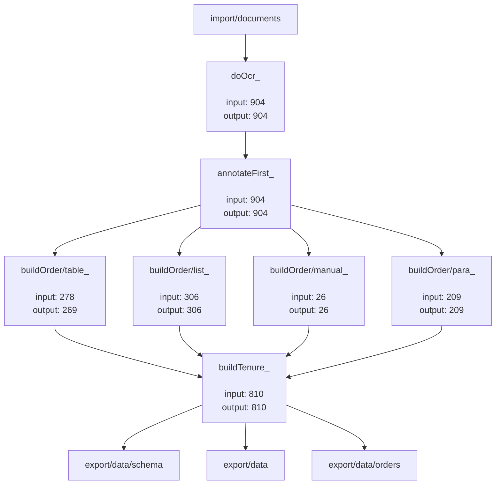

# calcu

Please Ignore.

* Documentation: <https://mukundesh.github.io/calcu>
* GitHub: <https://github.com/mukundesh/calcu>
* PyPI: <https://pypi.org/project/calcu/>
* Free software: MIT

## Features

* TODO

## Credits

This package was created with [Cookiecutter](https://github.com/audreyr/cookiecutter) and the [waynerv/cookiecutter-pypackage](https://github.com/waynerv/cookiecutter-pypackage) project template.

