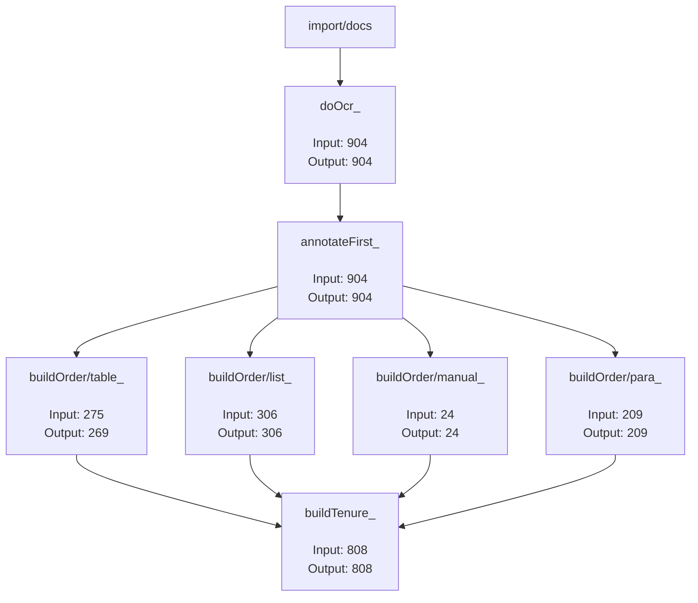

## Unprocessed Files: 93
### Ignored Files:
  - [ignore/duplicates_](ignore/duplicates_): 11
  - [ignore/swearingin_](ignore/swearingin_): 63
  - [ignore/notRelevant_](ignore/notRelevant_): 6
  - [ignore/todo_](ignore/todo_): 3
  - [ignore/correction_](ignore/correction_): 4
### Skipped Files:
  - [buildOrder/table_](buildOrder/table_): 6
---* This file is an auto-generated from directory structure of `flow` directory and links present in `input` and `output` sub-folders (tasks)*
