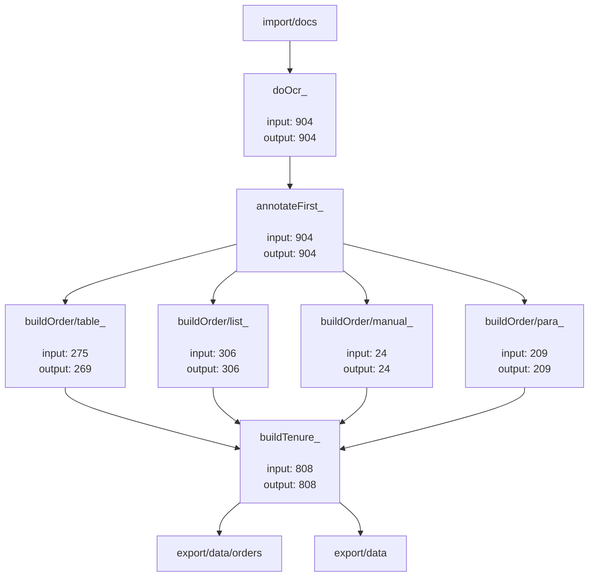

# Document Flow Diagram
This diagram is an auto-generated from directory structure of `flow` directory and links present in `input` and `output` sub-folders (tasks). Click the box (task) to explore more.

## Unprocessed Documents: 93
### Ignored Documents:
  - [ignore/duplicates_](ignore/duplicates_): 11
  - [ignore/swearingin_](ignore/swearingin_): 63
  - [ignore/notRelevant_](ignore/notRelevant_): 6
  - [ignore/todo_](ignore/todo_): 3
  - [ignore/correction_](ignore/correction_): 4
### Skipped Documents:
  - [buildOrder/table_](buildOrder/table_): 6
