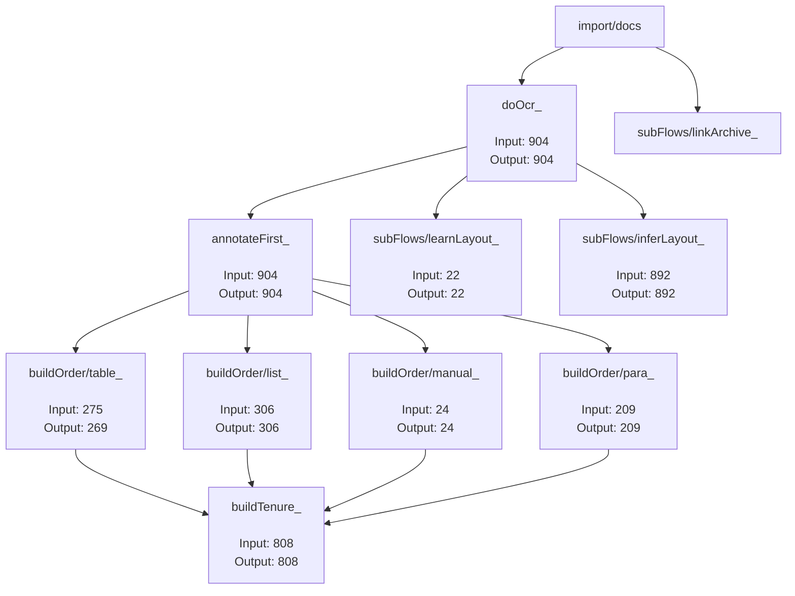

```mermaid
graph TD;
	buildOrder/table_[<div align=leg>buildOrder/table_</div><br/>Input: 275<br/>Output: 269] --> buildTenure_[<div align=leg>buildTenure_</div><br/>Input: 808<br/>Output: 808];
	buildOrder/list_[<div align=leg>buildOrder/list_</div><br/>Input: 306<br/>Output: 306] --> buildTenure_[<div align=leg>buildTenure_</div><br/>Input: 808<br/>Output: 808];
	buildOrder/manual_[<div align=leg>buildOrder/manual_</div><br/>Input: 24<br/>Output: 24] --> buildTenure_[<div align=leg>buildTenure_</div><br/>Input: 808<br/>Output: 808];
	buildOrder/para_[<div align=leg>buildOrder/para_</div><br/>Input: 209<br/>Output: 209] --> buildTenure_[<div align=leg>buildTenure_</div><br/>Input: 808<br/>Output: 808];
	annotateFirst_[<div align=leg>annotateFirst_</div><br/>Input: 904<br/>Output: 904] --> buildOrder/table_;
	annotateFirst_[<div align=leg>annotateFirst_</div><br/>Input: 904<br/>Output: 904] --> buildOrder/list_;
	annotateFirst_[<div align=leg>annotateFirst_</div><br/>Input: 904<br/>Output: 904] --> buildOrder/manual_;
	annotateFirst_[<div align=leg>annotateFirst_</div><br/>Input: 904<br/>Output: 904] --> buildOrder/para_;
	doOcr_[<div align=leg>doOcr_</div><br/>Input: 904<br/>Output: 904] --> annotateFirst_;
	doOcr_[<div align=leg>doOcr_</div><br/>Input: 904<br/>Output: 904] --> subFlows/learnLayout_[<div align=leg>subFlows/learnLayout_</div><br/>Input: 22<br/>Output: 22];
	doOcr_[<div align=leg>doOcr_</div><br/>Input: 904<br/>Output: 904] --> subFlows/inferLayout_[<div align=leg>subFlows/inferLayout_</div><br/>Input: 892<br/>Output: 892];
	import/docs --> subFlows/linkArchive_;
	import/docs --> doOcr_;
	click subFlows/inferLayout_ "https://github.com/orgpedia/cabsec2/tree/main/flow/subFlows/inferLayout_" "subFlows/inferLayout_";
	click annotateFirst_ "https://github.com/orgpedia/cabsec2/tree/main/flow/annotateFirst_" "annotateFirst_";
	click subFlows/learnLayout_ "https://github.com/orgpedia/cabsec2/tree/main/flow/subFlows/learnLayout_" "subFlows/learnLayout_";
	click buildOrder/table_ "https://github.com/orgpedia/cabsec2/tree/main/flow/buildOrder/table_" "buildOrder/table_";
	click buildTenure_ "https://github.com/orgpedia/cabsec2/tree/main/flow/buildTenure_" "buildTenure_";
	click buildOrder/list_ "https://github.com/orgpedia/cabsec2/tree/main/flow/buildOrder/list_" "buildOrder/list_";
	click buildOrder/manual_ "https://github.com/orgpedia/cabsec2/tree/main/flow/buildOrder/manual_" "buildOrder/manual_";
	click doOcr_ "https://github.com/orgpedia/cabsec2/tree/main/flow/doOcr_" "doOcr_";
	click buildOrder/para_ "https://github.com/orgpedia/cabsec2/tree/main/flow/buildOrder/para_" "buildOrder/para_";
	click import/docs "https://github.com/orgpedia/cabsec2/tree/main/import/docs" "import/docs";
```
